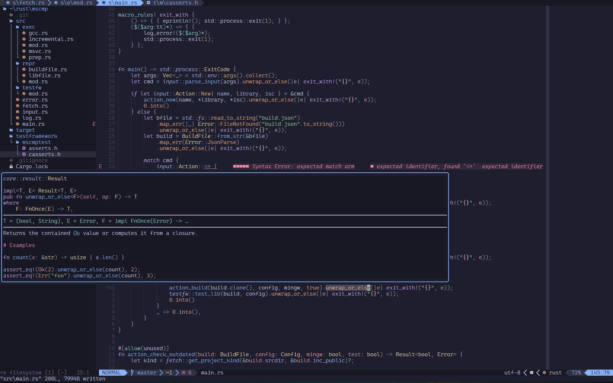

# PapaFrancesco vimrc

A backup/repo of my custom NeoVim config

## Plugins

### Colorscheme
- [catpuccin](https://github.com/catppuccin/nvim)
- [treesitter](https://github.com/nvim-treesitter/nvim-treesitter)

### LSP
- [mason](https://github.com/mason-org/mason.nvim')
- [mason-lspconfig](https://github.com/mason-org/mason-lspconfig.nvim')
- [cmp-nvim-lsp](https://github.com/hrsh7th/cmp-nvim-lsp')
- [nvim-cmp](https://github.com/hrsh7th/nvim-cmp')
- [LuaSnip](https://github.com/L3MON4D3/LuaSnip')
- [nvim-jdtls](https://github.com/mfussenegger/nvim-jdtls)

### File Management
- [telescope](https://github.com/nvim-telescope/telescope.nvim)
- [harpoon](https://github.com/theprimeagen/harpoon)
- [neo-tree](https://github.com/nvim-neo-tree/neo-tree.nvim)

### Convenience / Pretty
- [transparent](https://github.com/xiyaowong/transparent.nvim)
- [lualine](https://github.com/nvim-lualine/lualine.nvim)
- [tabline](https://github.com/kdheepak/tabline.nvim)
- [indent-blankline](https://github.com/lukas-reineke/indent-blankline.nvim)
- [noice](https://github.com/folke/noice.nvim)

